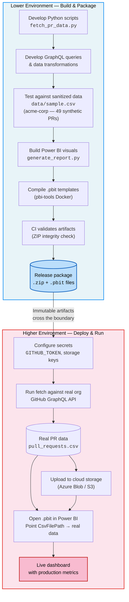
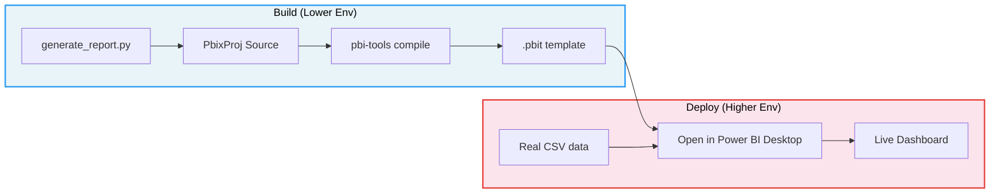

# Build Low, Deploy High

## What is "Build Low, Deploy High"?

**Build Low, Deploy High** is a deployment pattern where all development, testing, and packaging happens in a **lower environment** — using sanitized data, sandbox credentials, and isolated tooling — and the resulting artifacts are then **deployed into a higher (secure) environment** where they operate against real data with production credentials.

This pattern ensures that:

- **Sensitive data never enters the development pipeline.** Developers build and test against synthetic or anonymized data.
- **Artifacts are immutable.** The same template, script, or package that was validated in the sandbox is what runs in production — no ad hoc changes.
- **Secrets stay in production.** Tokens, connection strings, and API keys are injected at runtime in the secure environment, never baked into build artifacts.
- **The blast radius of mistakes is minimized.** A broken query or misconfigured visual is caught against fake data before it ever touches real systems.

---

## How This Project Implements It

The PR Dashboard follows this pattern across three layers: **data extraction** (Python + GraphQL), **visualization** (Power BI templates), and **automated refresh** (CI/CD workflows).

### The Two Environments

| | Lower Environment (Build) | Higher Environment (Deploy) |
|---|---|---|
| **Where** | Developer laptop or CI runner | Production workstation or scheduled workflow |
| **Data** | `data/sample.csv` — 49 synthetic PRs from "acme-corp" | `data/pull_requests.csv` — real PRs from a real GitHub org |
| **Credentials** | None required for template builds; optional sandbox token for testing fetch scripts | `GITHUB_TOKEN` PAT with `repo` scope; cloud storage secrets |
| **GitHub API** | Queries developed and tested against sandbox orgs or skipped entirely | Queries run against production org's GraphQL API |
| **Power BI** | `.pbit` templates compiled from source, validated as ZIP archives | Templates opened in Power BI Desktop, pointed at real CSV |
| **Output** | Build artifacts (`.pbit` files, release `.zip`) | Live dashboards, cloud-stored datasets |

---

## End-to-End Flow



---

## Layer-by-Layer Breakdown

### 1. Data Extraction Scripts (Python)

**Build low:** The GraphQL queries and Python logic in `src/fetch_pr_data.py` are developed and tested locally. The included `data/sample.csv` provides 49 synthetic pull requests attributed to the fictional "acme-corp" organization across repositories like `web-app`, `api-service`, `mobile-app`, and `infra`. Developers can validate CSV schema, column calculations (like `days_open` and `first_response_hours`), and DAX measure logic without ever querying a real GitHub org.

**Deploy high:** In the production environment, a real `GITHUB_TOKEN` is configured (as an environment variable, `.env` file, or GitHub Actions secret). The same script runs the same GraphQL queries — but now against a real organization, producing `data/pull_requests.csv` with actual PR data.

```
# Build (lower) — validate script logic against sample data
python src/fetch_pr_data.py --owner acme-corp --output data/test.csv

# Deploy (higher) — run against real org with real token
export GITHUB_TOKEN="ghp_real_token_here"
python src/fetch_pr_data.py --owner my-real-org --output data/pull_requests.csv
```

### 2. Power BI Templates

**Build low:** Report visuals are generated by `powerbi/generate_report.py`, which produces PbixProj-format `section.json` files. These are compiled into `.pbit` template files using pbi-tools in Docker. The entire build process is data-agnostic — templates contain a `CsvFilePath` parameter that is set at open time, not at build time. The CI pipeline (`build-pbit.yml`) validates that the output is a well-formed ZIP archive.

**Deploy high:** A user in the secure environment downloads the `.pbit` file from a GitHub Release, opens it in Power BI Desktop, and points the `CsvFilePath` parameter at their real CSV. The template — identical to what CI built — instantly populates with production data.



### 3. CI/CD Workflows

The GitHub Actions workflows formalize the boundary between environments:

| Workflow | Environment | Purpose |
|----------|-------------|---------|
| `build-pbit.yml` | **Lower** | Compiles `.pbit` templates from source — no secrets needed |
| `release.yml` | **Lower → Boundary** | Packages scripts + templates + sample data into a release `.zip` |
| `refresh-data.yml` | **Higher** | Runs in production with `GITHUB_TOKEN_PAT` and cloud storage secrets to fetch real data |

The release package that crosses the boundary includes:

- `src/` — Python scripts (no embedded credentials)
- `powerbi/*.pbit` — Compiled templates (parameterized, no data)
- `data/sample.csv` — Sanitized sample data for previewing
- `requirements.txt`, `README.md`, setup docs

It explicitly **excludes** `.env` files, real data CSVs, and any credentials.

---

## Key Design Decisions That Enable This Pattern

### Parameterized data source

The Power BI data model uses a `CsvFilePath` parameter (defined in `Model/expressions.tmdl`) rather than a hardcoded path. This means the same `.pbit` binary works in any environment — the data source is injected at runtime.

### Sanitized sample data

The `data/sample.csv` file uses fictional identities ("acme-corp", usernames like "agarcia" and "mchen") with realistic but synthetic metrics. This lets developers validate every DAX measure, chart visual, and data transformation without exposing real organizational data.

### Secrets at the boundary

No workflow in the build pipeline requires secrets. The `build-pbit.yml` workflow needs only `contents: read` permission. Secrets (`GITHUB_TOKEN_PAT`, `AZURE_STORAGE_CONNECTION_STRING`, S3 keys) are only referenced in `refresh-data.yml`, which runs in the production context.

### Immutable artifacts

The `.pbit` files produced by CI are the same ones attached to GitHub Releases. There is no "production build" step — the artifact built against sandbox data is the artifact deployed to production. The only thing that changes is the data it consumes.

---

## Summary

| Principle | How It's Applied |
|-----------|-----------------|
| **Build with fake data** | `data/sample.csv` with "acme-corp" synthetic PRs |
| **No secrets in build** | `build-pbit.yml` requires zero secrets; templates are parameterized |
| **Immutable artifacts** | Same `.pbit` file from CI is attached to Releases and opened in production |
| **Secrets injected at deploy time** | `GITHUB_TOKEN`, storage keys configured only in the higher environment |
| **Same code, different data** | `fetch_pr_data.py` runs identically — only the `--owner` and token change |
| **Clear boundary** | Release `.zip` is the handoff point; everything inside is safe to inspect |
